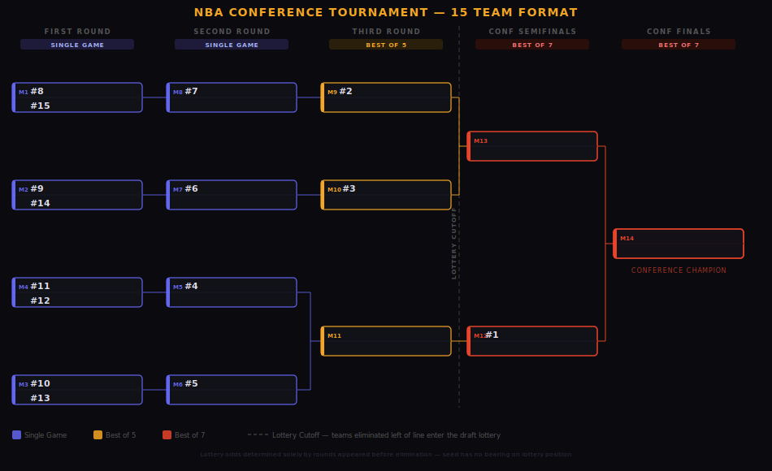
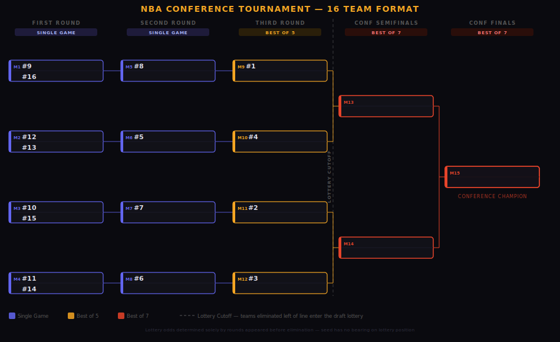

# 0300: Postseason Tournament

## Summary

Replace the current NBA playoff format with a stepladder tournament in which regular season seeding determines when a team enters the bracket, giving higher seeds a structural advantage in the form of fewer wins required to become conference champion.

## Motivation

The current playoff format produces two structural problems.

**Seeding differences carry little weight.** The difference between finishing first and fourth in a conference is home court advantage for one round — a marginal benefit that rarely changes outcomes. Teams have little reason to compete hard for seeding once a playoff spot is secured, and games late in the season between teams that have clinched carry no weight.

**Only eight of fifteen teams participate.** Seven teams are excluded from the postseason entirely, removing competitive incentive for roughly half the league in the final weeks of the season and contributing to the tanking problem addressed in [0500](0500.md).

This proposal addresses both problems by including all 15 teams in a stepladder tournament where every seed position carries a distinct structural reward, and where the path to a championship is meaningfully harder for lower seeds. Tournament results also determine draft lottery eligibility as defined in [0500](0500.md), working in concert with the standings reform in [0200](0200.md) as part of a broader effort to make tanking irrational at every stage of the season.

## Proposal

### Conference Structure

Each conference operates as an independent bracket with all 15 teams (or 16 teams upon expansion), seeded by the standings and tiebreaker hierarchy defined in [0200](0200.md). The two conference champions meet in the NBA Finals in a best-of-7 series. Each individual game in the tournament is played under the match format defined in [0100](0100.md).

### Seeding and Bracket Entry

The reward for a higher regular season seed is a later entry point into the bracket — meaning fewer wins required to become conference champion, more rest between rounds, and a more favorable first opponent. Every seed position from 1 to 15 carries a distinct structural advantage over the seed below it.

#### 15-Team Format

**First Round** (single game):
- Match 1: Seed 8 vs. Seed 15
- Match 2: Seed 9 vs. Seed 14
- Match 3: Seed 10 vs. Seed 13
- Match 4: Seed 11 vs. Seed 12

**Second Round** (single game) — Seeds 4, 5, 6, and 7 enter:
- Match 5: Seed 4 vs. Winner of Match 4
- Match 6: Seed 5 vs. Winner of Match 3
- Match 7: Seed 6 vs. Winner of Match 2
- Match 8: Seed 7 vs. Winner of Match 1

**Third Round** (best-of-5) — Seeds 2 and 3 enter:
- Match 9: Seed 2 vs. Winner of Match 8
- Match 10: Seed 3 vs. Winner of Match 7
- Match 11: Winner of Match 5 vs. Winner of Match 6

**Conference Semifinals** (best-of-7) — Seed 1 enters:
- Match 12: Seed 1 vs. Winner of Match 11
- Match 13: Winner of Match 9 vs. Winner of Match 10

**Conference Finals** (best-of-7):
- Match 14: Winner of Match 12 vs. Winner of Match 13

#### 16-Team Format

The 16-team format applies upon NBA expansion. Seeds 1 through 4 all enter in the Third Round, producing a more symmetric bracket.

**First Round** (single game):
- Match 1: Seed 9 vs. Seed 16
- Match 2: Seed 12 vs. Seed 13
- Match 3: Seed 10 vs. Seed 15
- Match 4: Seed 11 vs. Seed 14

**Second Round** (single game) — Seeds 5, 6, 7, and 8 enter:
- Match 5: Seed 8 vs. Winner of Match 1
- Match 6: Seed 5 vs. Winner of Match 2
- Match 7: Seed 7 vs. Winner of Match 3
- Match 8: Seed 6 vs. Winner of Match 4

**Third Round** (best-of-5) — Seeds 1, 2, 3, and 4 enter:
- Match 9: Seed 1 vs. Winner of Match 5
- Match 10: Seed 4 vs. Winner of Match 6
- Match 11: Seed 2 vs. Winner of Match 7
- Match 12: Seed 3 vs. Winner of Match 8

**Conference Semifinals** (best-of-7):
- Match 13: Winner of Match 9 vs. Winner of Match 10
- Match 14: Winner of Match 11 vs. Winner of Match 12

**Conference Finals** (best-of-7):
- Match 15: Winner of Match 13 vs. Winner of Match 14

### Series Format by Round

| Round | Format |
|-------|--------|
| First Round | Single game |
| Second Round | Single game |
| Third Round | Best-of-5 |
| Conference Semifinals | Best-of-7 |
| Conference Finals | Best-of-7 |
| NBA Finals | Best-of-7 |

## Rationale

### Why all 15 teams participate

Including all 15 teams removes the hard cliff that currently strips competitive incentive from teams out of playoff contention. Under this format, every team competes for seeding throughout the entire regular season. The practical consequence of a poor regular season record is a harder path through the tournament, not exclusion from it. This is a more proportionate reward structure than simple elimination.

### Why a stepladder rather than seeded matchups

The current format rewards seeding only with home court advantage, which is marginal. The stepladder format makes the reward dramatically larger — a difference of one or two seeds can mean an entire extra round of games an opponent must survive before facing you. Seed 1 in the 15-team format needs only two wins to reach the conference title. Seed 15 needs five. Every position in the standings carries a distinct and meaningful structural reward.

### Why single games in early rounds

Lower seeds have not earned the protection of a multi-game series. Single elimination in the opening rounds is also a strong anti-tanking format: a team cannot manage its performance strategically across multiple games, and players have strong individual incentives to win any given game regardless of organizational preferences.

### Why best-of-5 in the Third Round

The Third Round is where the top seeds first enter the bracket — seeds 2 and 3 in the 15-team format, seeds 1 through 4 in the 16-team format — facing opponents who have already won two consecutive games. A single elimination game at this stage would be too volatile for teams that earned those regular season finishes. Best-of-5 provides a meaningful safety net without the duration of a full seven-game series.

## Changelog

- 2026-02-19: Initial version
